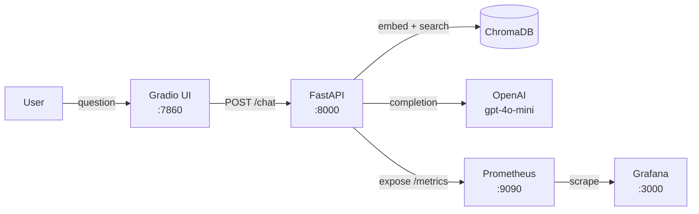

# Grafana RAG Chatbot + Observability

A production-grade RAG chatbot that answers questions **about Grafana**, monitored **in Grafana**. Built as a portfolio project demonstrating FDE-level engineering: real instrumentation, real observability, real data.

## Architecture



## Quick Start

### 1. Prerequisites

- Docker + Docker Compose
- OpenAI API key

### 2. Configure

```bash
cp .env.example .env
# Edit .env and add your OPENAI_API_KEY
```

### 3. Download and index Grafana docs

```bash
pip install langchain-community langchain-openai langchain-chroma chromadb openai pydantic-settings python-dotenv
python scripts/download_docs.py
python scripts/ingest_docs.py
```

### 4. Start all services

```bash
docker compose up --build
```

### 5. Verify

```bash
# Health check
curl localhost:8000/health
# Expected: {"status":"ok","chroma_doc_count":N}

# Custom metrics present
curl localhost:8000/metrics | grep rag_

# Chat endpoint
curl -X POST localhost:8000/chat \
  -H "Content-Type: application/json" \
  -d '{"question": "What is Grafana Loki?"}'
```

| Service    | URL                   |
| ---------- | --------------------- |
| Chatbot UI | http://localhost:7860 |
| API        | http://localhost:8000 |
| Prometheus | http://localhost:9090 |
| Grafana    | http://localhost:3000 |

Grafana login: `admin` / `admin`

## Grafana Dashboards

Four auto-provisioned dashboards in the **RAG Chatbot** folder:

| Dashboard   | Key Metric                                           |
| ----------- | ---------------------------------------------------- |
| Latency     | p95/p99 per endpoint, LLM latency, retrieval latency |
| Error Rate  | HTTP 4xx/5xx rate, RAG pipeline errors               |
| Throughput  | Requests per minute, cumulative success count        |
| Token Usage | Avg tokens/request, p95 tokens, token rate           |

<video src="data/readme/Grafana%20dashboard.mov" controls width="100%"></video>

### Generate load for dashboards

```bash
python scripts/load_test.py --n 30
```


## Demo Questions

- "What is Grafana Loki?"
- "How do I create a dashboard in Grafana?"
- "What data sources does Grafana support?"
- "How does Grafana alerting work?"
- "What is the difference between Grafana OSS and Enterprise?"

## Running Tests

```bash
pip install -r requirements.txt
pytest tests/ -v
```

## Project Structure

```
app/
  main.py           # FastAPI app, Prometheus wiring, lifespan
  config.py         # Pydantic BaseSettings
  api/
    chat.py         # POST /chat — RAG + metrics
    health.py       # GET /health
  rag/
    pipeline.py     # LCEL chain + timed phases
    embeddings.py   # OpenAI embeddings
    vectorstore.py  # ChromaDB PersistentClient
  metrics/
    custom.py       # Histograms: tokens, retrieval latency, LLM latency
frontend/
  gradio_app.py     # Gradio ChatInterface
scripts/
  download_docs.py  # Fetch ~60 Grafana .md files from GitHub
  ingest_docs.py    # Chunk + embed into ChromaDB
  load_test.py      # Generate traffic for dashboards
observability/
  prometheus/       # prometheus.yml
  grafana/          # Provisioned datasource + dashboards
```

## Key Design Decisions

- **ChromaDB PersistentClient** (not ephemeral) — survives container restarts via volume mount
- **Timed phases** — retrieval and LLM latency tracked separately for debugging bottlenecks
- **CORS enabled** — Gradio → FastAPI cross-origin calls work out of the box
- **Docker service names** — never `localhost` for cross-container URLs
- **ARM Mac compatible** — Dockerfile includes `build-essential` for HNSWLIB compilation
