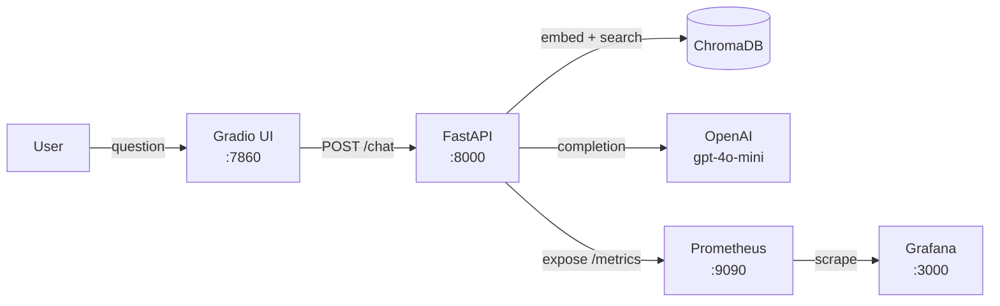

# Grafana RAG Chatbot + Observability

A production-grade RAG chatbot that answers questions **about Grafana**, monitored **in Grafana**. Built as a portfolio project demonstrating FDE-level engineering: real instrumentation, real observability, real data.

## Architecture



## Phase 2 Features

Phase 2 adds four production-oriented capabilities on top of the core RAG pipeline:

| Feature                     | What it does                                                                                                                                                  |
| --------------------------- | ------------------------------------------------------------------------------------------------------------------------------------------------------------- |
| **Conversation Memory**     | LangChain `ConversationBufferMemory` keyed by `session_id` — each session keeps its own history so follow-up questions work naturally                         |
| **Feedback Loop**           | Thumbs 👍/👎 in the Gradio UI POST to `/feedback`, incrementing a `rag_feedback_total{rating}` Prometheus counter visible in the Token Usage dashboard        |
| **Cross-encoder Reranking** | After ChromaDB returns k=6 candidates, `cross-encoder/ms-marco-MiniLM-L-6-v2` rescores and keeps the top 3 — improving answer quality without extra API calls |
| **API Key Auth**            | `/chat` requires an `X-API-Key` header; set `API_KEY` in `.env` (defaults to `dev-key-123` in development)                                                    |


## Quick Start

### 1. Prerequisites

- Docker + Docker Compose
- OpenAI API key

### 2. Configure

```bash
cp .env.example .env
# Edit .env and add your OPENAI_API_KEY
```

### 3. Download and index Grafana docs

```bash
pip install langchain-community langchain-openai langchain-chroma chromadb openai pydantic-settings python-dotenv
python scripts/download_docs.py
python scripts/ingest_docs.py
```

### 4. Start all services

```bash
docker compose up --build
```

### 5. Verify

```bash
# Health check
curl localhost:8000/health
# Expected: {"status":"ok","chroma_doc_count":N}

# Custom metrics present
curl localhost:8000/metrics | grep rag_

# Chat endpoint (X-API-Key required — matches API_KEY in .env)
curl -X POST localhost:8000/chat \
  -H "Content-Type: application/json" \
  -H "X-API-Key: dev-key-123" \
  -d '{"question": "What is Grafana Loki?"}'

# Multi-turn: follow-up with the same session_id
curl -X POST localhost:8000/chat \
  -H "Content-Type: application/json" \
  -H "X-API-Key: dev-key-123" \
  -d '{"question": "How does it compare to Elasticsearch?", "session_id": "test-session"}'

# Submit feedback (rating: up or down)
curl -X POST "localhost:8000/feedback?session_id=test-session&rating=up"
```

| Service    | URL                   |
| ---------- | --------------------- |
| Chatbot UI | http://localhost:7860 |
| API        | http://localhost:8000 |
| Prometheus | http://localhost:9090 |
| Grafana    | http://localhost:3000 |

Grafana login: `admin` / `admin`

## Environment Variables

| Variable          | Default                  | Description                                 |
| ----------------- | ------------------------ | ------------------------------------------- |
| `OPENAI_API_KEY`  | —                        | Required. Your OpenAI key                   |
| `API_KEY`         | `dev-key-123`            | Bearer key for `/chat` (`X-API-Key` header) |
| `LLM_MODEL`       | `gpt-4o-mini`            | OpenAI chat model                           |
| `EMBEDDING_MODEL` | `text-embedding-3-small` | OpenAI embedding model                      |

## Grafana Dashboards

Four auto-provisioned dashboards in the **RAG Chatbot** folder:

| Dashboard   | Key Metric                                                        |
| ----------- | ----------------------------------------------------------------- |
| Latency     | p95/p99 per endpoint, LLM latency, retrieval latency              |
| Error Rate  | HTTP 4xx/5xx rate, RAG pipeline errors                            |
| Throughput  | Requests per minute, cumulative success count                     |
| Token Usage | Avg tokens/request, p95 tokens, token rate, 👍/👎 feedback counts |

<video src="data/readme/Grafana%20dashboard.mov" controls width="100%"></video>

### Generate load for dashboards

```bash
python scripts/load_test.py --n 30
```


## Demo Questions

- "What is Grafana Loki?"
- "How do I create a dashboard in Grafana?"
- "What data sources does Grafana support?"
- "How does Grafana alerting work?"
- "What is the difference between Grafana OSS and Enterprise?"

## Running Tests

```bash
pip install -r requirements.txt
pytest tests/ -v
```

## RAG Evaluation (RAGAS)

The pipeline is evaluated with [RAGAS](https://docs.ragas.io) against a hand-crafted dataset of 35 question/ground-truth pairs drawn from the ingested Grafana docs (`data/eval_dataset.json`).

Four metrics are measured:

| Metric                | What it measures                                                 |
| --------------------- | ---------------------------------------------------------------- |
| **Faithfulness**      | Does the answer stay grounded in the retrieved context?          |
| **Answer Relevancy**  | Is the answer on-topic for the question?                         |
| **Context Precision** | Are the most useful chunks ranked highest?                       |
| **Context Recall**    | Does the retrieved context cover what the ground truth requires? |

### Running an evaluation

```bash
# Install eval dependencies (one-time)
pip install "ragas>=0.2,<0.3" "datasets>=2.19"

# Run — saves per-question scores to data/eval_results_<label>_<timestamp>.csv
python scripts/evaluate_rag.py --output baseline
```

### Experiment: increasing reranker top_k from 3 → 5

Changing `top_k` in `pipeline.py` from 3 to 5 passes more retrieved chunks to the LLM.

| Metric            | Baseline (top_k=3) | top_k=5 | Delta      |
| ----------------- | ------------------ | ------- | ---------- |
| Faithfulness      | 0.816              | 0.831   | +0.014     |
| Answer Relevancy  | 0.843              | 0.927   | **+0.083** |
| Context Precision | 0.714              | 0.697   | -0.017     |
| Context Recall    | 0.519              | 0.557   | +0.038     |

**Findings:** Expanding the context window from 3 to 5 chunks gave the LLM more information to draw on — answer relevancy jumped +9.9% and context recall improved +7.3%. The small precision drop (−2.4%) is expected: with more chunks surfaced, the ranking becomes slightly noisier, but the overall answer quality improved. The current configuration uses `top_k=5`.

## Project Structure

```
app/
  main.py           # FastAPI app, Prometheus wiring, lifespan
  config.py         # Pydantic BaseSettings
  auth.py           # X-API-Key middleware (verify_api_key)
  reranker.py       # Cross-encoder reranking (ms-marco-MiniLM-L-6-v2)
  api/
    chat.py         # POST /chat — RAG + metrics + auth
    feedback.py     # POST /feedback — thumbs up/down counter
    health.py       # GET /health
  rag/
    pipeline.py     # Retrieval + reranking + ConversationBufferMemory + timed phases
    embeddings.py   # OpenAI embeddings
    vectorstore.py  # ChromaDB PersistentClient
  metrics/
    custom.py       # Histograms: tokens, retrieval latency, LLM latency; Counter: feedback
frontend/
  gradio_app.py     # Gradio ChatInterface with thumbs up/down feedback
scripts/
  download_docs.py  # Fetch ~60 Grafana .md files from GitHub
  ingest_docs.py    # Chunk + embed into ChromaDB
  load_test.py      # Generate traffic for dashboards
  evaluate_rag.py   # RAGAS evaluation — runs pipeline against eval_dataset.json
data/
  eval_dataset.json # 35 hand-crafted Q&A pairs for RAGAS evaluation
  eval_results_*.csv # Per-question RAGAS scores (generated, not committed)
observability/
  prometheus/       # prometheus.yml
  grafana/          # Provisioned datasource + dashboards
```

## Key Design Decisions

- **ChromaDB PersistentClient** (not ephemeral) — survives container restarts via volume mount
- **Timed phases** — retrieval and LLM latency tracked separately for debugging bottlenecks
- **CORS enabled** — Gradio → FastAPI cross-origin calls work out of the box
- **Docker service names** — never `localhost` for cross-container URLs
- **ARM Mac compatible** — Dockerfile includes `build-essential` for HNSWLIB compilation
- **Cross-encoder baked into image** — `ms-marco-MiniLM-L-6-v2` is downloaded at `docker build` time so startup is fast
- **Session memory is in-process** — `ConversationBufferMemory` lives in the FastAPI process dict; it resets on container restart (fine for a portfolio project, swap for Redis in production)
- **Feedback needs no DB** — thumbs up/down go straight to a Prometheus counter; durable storage is a natural next step
